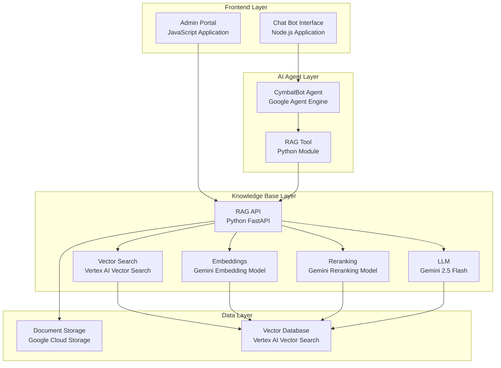

# CymbalBot - Internal Knowledge Assistant

An AI-powered internal knowledge assistant built with Google's Agent Development Kit (ADK) and deployed on Google Agent Engine. CymbalBot helps employees find information about company policies, procedures, benefits, IT resources, and other internal matters.

## System Architecture



### Architecture Components

1. **Chat Bot Interface (Node.js)** - User-facing chat interface for employees
2. **Admin Portal (JavaScript)** - Interface for uploading and managing documents
3. **CymbalBot Agent (Google Agent Engine)** - Deployed AI agent using Google ADK
4. **RAG API (Python FastAPI)** - Backend service for document search and retrieval
5. **Vector Search (Vertex AI)** - Semantic search using embeddings
6. **Document Storage (GCS)** - File storage for company documents

## Quick Start

### Prerequisites

- Python 3.8 or higher
- Anaconda or Miniconda (recommended)
- Google Cloud Project with Vertex AI enabled
- Service Account with appropriate permissions
- RAG API running (separate service)

### 1. Setup

Run the setup script to initialize the project:

```bash
python setup.py
```

This will:
- Create necessary directories
- Set up configuration templates
- Create conda environment named `cymbal-agent`
- Install dependencies in the conda environment
- Guide you through the setup process

After setup, activate the conda environment:

```bash
conda activate cymbal-agent
```

### 2. Configuration

#### Download Google Cloud Credentials

1. Go to [Google Cloud Console](https://console.cloud.google.com/)
2. Navigate to IAM & Admin > Service Accounts
3. Create or select a service account
4. Generate a JSON key and download it
5. Save it as `service-account-key.json` in the project root

#### Update Configuration Files

**Edit `.env` file:**
```bash
# GCP Configuration
GOOGLE_CLOUD_PROJECT_ID=your-project-id
GOOGLE_APPLICATION_CREDENTIALS=service-account-key.json
GOOGLE_CLOUD_REGION=us-central1

# Vertex AI Configuration
VERTEX_AI_LOCATION=us-central1
VERTEX_AI_MODEL_NAME=gemini-2.5-flash
VERTEX_STAGING_BUCKET=gs://your-bucket-name

# RAG API Configuration
RAG_BASE_URL=http://your-rag-api-url:8000
API_AUTH_TOKEN=your-api-token
```

**Edit `config/agent_engine.json`:**
```json
{
  "agent_resource_name": "projects/YOUR_PROJECT_ID/locations/us-central1/reasoningEngines/YOUR_AGENT_ID",
  "project_id": "your-gcp-project-id",
  "location": "us-central1"
}
```

### 3. Test Local Agent

Test the agent locally before deployment:

```bash
# Make sure conda environment is activated
conda activate cymbal-agent

# Run local tests
python scripts/test_local_agent.py
```

### 4. Deploy Agent

Deploy the agent to Google Agent Engine:

```bash
# Make sure conda environment is activated
conda activate cymbal-agent

# Deploy agent
python deploy.py
```

### 5. Test Deployed Agent

Test the deployed agent:

```bash
# Make sure conda environment is activated
conda activate cymbal-agent

# Test deployed agent
python scripts/test_deployed_agent.py
```

### 6. Use CLI Interface

Interact with the agent via command line:

```bash
# Make sure conda environment is activated
conda activate cymbal-agent

# Start CLI interface
python agent_cli.py
```

## Development with Google ADK

### RAG Tool Strategy

Our RAG tool implements a sophisticated retry strategy for robust document retrieval:

#### Multi-Strategy Search Approach

```python
def rag_search(query: str) -> Dict[str, Any]:
    search_strategies = [
        # Strategy 1: High confidence with inferred tags
        {
            "query": query,
            "ktop": RAG_KTOP,
            "threshold": 0.6,
            "tags": _choose_tags_from_text(query)
        },
        # Strategy 2: Lower threshold, broader search
        {
            "query": query,
            "ktop": RAG_KTOP,
            "threshold": 0.3
        },
        # Strategy 3: Medium threshold as fallback
        {
            "query": query,
            "ktop": RAG_KTOP,
            "threshold": 0.5
        }
    ]
```

#### Tag Inference System

The tool uses intelligent tag inference to improve search accuracy:

```python
_COMPANY_TAG_MAPPING = {
    "hr": ["hr", "human resources", "employee", "benefits", "payroll"],
    "tech": ["tech", "technology", "it", "software", "development"],
    "policy": ["policy", "policies", "guidelines", "procedures"],
    "onboarding": ["onboarding", "new employee", "orientation", "training"]
}
```

#### Progressive Search Strategy

1. **High Confidence Search** - Uses inferred tags with 0.6 threshold
2. **Broad Search** - Removes tags, lowers threshold to 0.3
3. **Fallback Search** - Medium threshold of 0.5 as final attempt

### Agent Registration

The agent is registered using Google ADK's `Agent` class:

```python
from google.adk.agents import Agent
from vertexai.agent_engines import AdkApp

agent = Agent(
    model=MODEL_NAME,
    name="cymbal_knowledge_bot",
    tools=[rag_search],
    instruction=system_instructions,
    generate_content_config={"temperature": 0.2}
)

app = AdkApp(agent=agent)
```

### Tool Integration

The RAG tool is seamlessly integrated as a function that the agent can call:

```python
def rag_search(query: str) -> Dict[str, Any]:
    """
    Enhanced RAG search with multiple strategies and better logging.
    Returns structured data with citations and metadata.
    """
    # Implementation with retry logic and citation generation
```

## Project Structure

```
cymbal-agent/
├── agents/                    # Agent core modules
│   ├── __init__.py
│   ├── agent_core.py         # ADK agent definition
│   └── rag_tool.py           # RAG search tool
├── config/                   # Configuration files
│   ├── agent_engine.json.template
│   └── agent_engine.json     # (gitignored)
├── scripts/                  # Test and utility scripts
│   ├── test_local_agent.py
│   ├── test_deployed_agent.py
│   ├── test_deployed_agent_simple.py
│   └── test_deployment.py
├── test_results/             # Test output (gitignored)
├── agent_cli.py             # CLI interface
├── deploy.py                # Deployment script
├── setup.py                 # Setup script
├── requirements.txt         # Python dependencies
├── .env.template           # Environment template
├── .env                    # Environment config (gitignored)
├── service-account-key.json # GCP credentials (gitignored)
└── README.md
```

## Testing

### Test Scripts

- **`test_local_agent.py`** - Tests local agent with RAG API
- **`test_deployed_agent.py`** - Tests deployed agent functionality
- **`test_deployed_agent_simple.py`** - Basic functionality tests
- **`test_deployment.py`** - Deployment validation tests

### Running Tests

```bash
# Activate conda environment first
conda activate cymbal-agent

# Test local agent
python scripts/test_local_agent.py

# Test deployed agent
python scripts/test_deployed_agent.py

# Run all tests using test runner
python run_tests.py local
python run_tests.py deployed
```

### Test Results

All test results are saved in the `test_results/` directory with detailed metrics including:
- Query success rates
- Citation accuracy
- Markdown formatting validation
- Response quality metrics

## Deployment

### Prerequisites

1. Google Cloud Project with Vertex AI enabled
2. Service Account with required permissions
3. Google Cloud Storage bucket for staging
4. RAG API deployed and accessible

### Deploy Process

```bash
# 1. Activate conda environment
conda activate cymbal-agent

# 2. Ensure configuration is correct
python setup.py

# 3. Deploy to Agent Engine
python deploy.py

# 4. Test deployment
python scripts/test_deployed_agent.py
```

### Environment Variables

The deployment process automatically includes these environment variables:
- `VERTEX_AI_MODEL_NAME`
- `RAG_BASE_URL`
- `RAG_KTOP`
- `RAG_THRESHOLD`
- `RAG_ALLOWED_TAGS`
- `RAG_DEFAULT_TAG`
- `API_AUTH_TOKEN`

## Configuration

### Environment Variables

| Variable | Description | Default |
|----------|-------------|---------|
| `GOOGLE_CLOUD_PROJECT_ID` | GCP Project ID | Required |
| `GOOGLE_APPLICATION_CREDENTIALS` | Service account key file | `service-account-key.json` |
| `VERTEX_AI_LOCATION` | Vertex AI region | `us-central1` |
| `VERTEX_AI_MODEL_NAME` | LLM model name | `gemini-2.5-flash` |
| `VERTEX_STAGING_BUCKET` | GCS bucket for staging | Required |
| `RAG_BASE_URL` | RAG API endpoint | Required |
| `API_AUTH_TOKEN` | RAG API authentication token | Required |

### Agent Configuration

The agent configuration is stored in `config/agent_engine.json` and includes:
- Agent resource name
- Project and location details
- RAG API configuration
- Environment variables

## Features

### RAG Capabilities

- **Semantic Search** - Uses Vertex AI Vector Search for intelligent document retrieval
- **Multi-Strategy Search** - Implements progressive search strategies for better results
- **Tag-Based Filtering** - Intelligent tag inference for targeted searches
- **Citation Generation** - Automatic generation of downloadable document links
- **Retry Logic** - Robust error handling and retry mechanisms

### Agent Features

- **Context-Aware Responses** - Maintains conversation context
- **Markdown Formatting** - Consistent, professional response formatting
- **Citation Support** - Provides source documents for all answers
- **Error Handling** - Graceful handling of API failures and edge cases
- **Logging** - Comprehensive logging for debugging and monitoring

### CLI Features

- **Interactive Mode** - Real-time chat interface
- **Color-Coded Output** - User input, system output, and logs are color-coded
- **Warning Suppression** - Clean output without ADK warnings
- **Error Handling** - Graceful handling of input errors and interruptions

## Troubleshooting

### Common Issues

1. **Authentication Errors**
   - Verify service account key is correctly placed
   - Check GCP project permissions
   - Ensure Vertex AI is enabled

2. **RAG API Connection Issues**
   - Verify RAG API is running and accessible
   - Check API_AUTH_TOKEN is correct
   - Ensure network connectivity

3. **Deployment Failures**
   - Check GCS bucket permissions
   - Verify staging bucket exists
   - Review deployment logs

### Debug Mode

Enable detailed logging by setting the log level in the RAG tool:

```python
logging.basicConfig(level=logging.DEBUG)
```